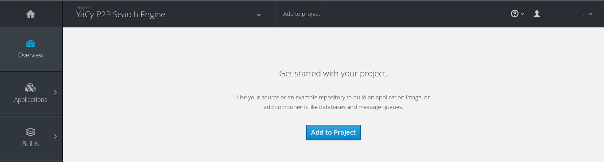
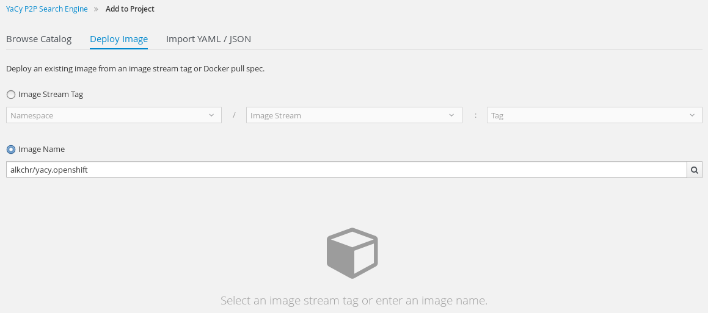
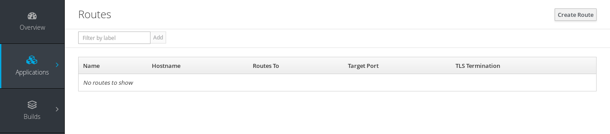
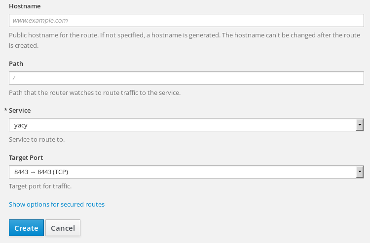

# yacy.openshift
Dockerfile for running YaCy, a peer to peer search engine, on OpenShift Online platform.

### HowTo
#### 1. Create a new project.
#### 2. Open it, and click "Add to Project".

#### 3. Select "Deploy Image" tab and enter `alkchr/yacy.openshift` as image name.

#### 4. Press "enter" and set a name.

#### 5. Open "Application/Routes" tab and create a new Route.

#### 6. Use `8443` as a Target Port, configure "secured routes".

#### 7. Visit your newly installed YaCy instance to set credentials.
If you have used `passthrough` TLS Termination mode, custom unsigned certificates
generated by YaCy will be used. So, you may have to add a security exception in your browser.

### License
Distributed under the BSD 2-clause "Simplified" License unless otherwise noted.
